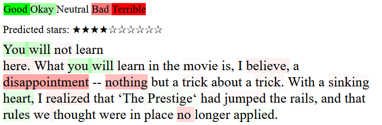
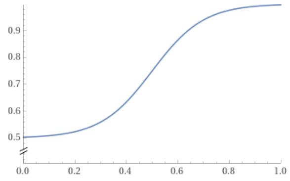
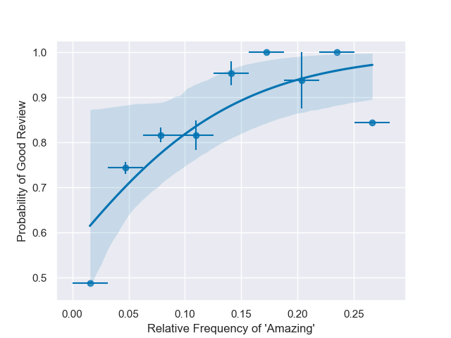
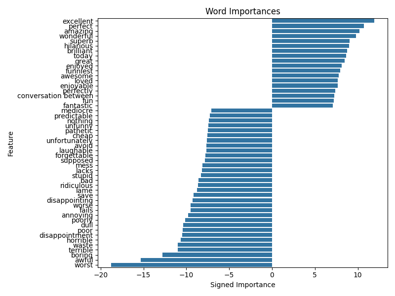

# Movie Review Sentiments by Matt Inglis-Whalen

This project is my first step towards building an interactive portfolio.
The goal is simple: from a common dataset conisting of 50k Netflix reviews,
paired with the rating associated with the review, can we make predictions about
the general sentiment of a newly written review?

In what follows I'll give an overview of the steps involved:

1. Converting a review into a machine-readable format using a bag-of-words model
2. Fitting the bag-of-words to a logistic regression
3. Deploying the model to a server (AWS EC2-instance micro)
4. Setting up interactivity

## 1. A Bag of Words

The first step in converting a block of text into a machine-readable format
is to "tokenize" each important chunk of the string. The simplest thing you 
can do is break up a string into words, and convert each word into an integer.
So the string "The fat cat sat on another cat" could be tokenized to a list of 
integers [0,1,2,3,4,5,2] through a dictionary {"the" : 0, "fat" : 1, "cat" : 2
"sat" : 3, "on" : 4, "another" : 5}. If I train my tokenizer on more documents,
the vocabulary grows, so I might also have {"dog":6, "ate":7, "my":8, "homework":9}
in the vocabulary after training on another string.

Some additional things to think about 
are how to deal with punctuation, or accented characters like ç, or which words
we don't want to include in the vocabulary. I've used a
tokenizer which converts all accented characters into their non-accented ASCII
relatives, and which treats punctuation like a space. I've also used an exclusion
list to remove common words from the vocabulary that shouldn't affect the 
rating of a review -- words like "the", "a", and "and" -- since these don't
add information about whether a review was good or bad.

Now that we can make words machine-readable, we can decide how to encode an
entire review. To keep it really simple I've used a bag of words model, which 
throws away all positional information of each word, and instead 
simply counts how often each word appears in a document. The example above
would generate a bag of words {0:1, 1:1, 2:2, 3:1, 4:1, 5:1, 6:0, 7:0, 8:0, 9:0}, i.e. the word "the"
appeared once, the word "cat" appeared twice, and the word "dog" appeared zero
times. Usually though, the bag-of-words is implemented as a sparse array, which 
only includes the non-zero entries.

You can further choose to keep *some* positional information: the vocabulary 
can be extended to include two-word chunks, so that the string "the cat" 
get its own token. This is important for situations like the string "not great", where
"not" doesn't have much meaning by itself, "great" is a strong 
positive word, while the two together "not great" is moderately negative. I
chose to have my vocabulary include only 1- and 2-word tokens.

My first instinct was to use the TfidfVectorizer to implement the bag-of-words
model. This scikit-learn class is a combination of the CountVectorizer, which
counts the number of tokens in a review as described above, but also uses
the "Term Frequency x Inverse Document Frequency" to normalize the counts of each
token so that the review length isn't a factor for inference. 

However, the `TfidfVectorizer` has to store a dictionary representing its 
vocabulary. When trained across 50K reviews, while including single- and 
double-words, the size of the model reached around 500MB (shoutout to the 
`asizeof` package for letting me see how much memory a class 
instance is actually using). An AWS EC2-instance only has 500MB of memory, so
deploying such a large vocabulary to such a small server is out of the question.

Enter the `HashingVectorizer`. This class does essentially the same thing as
the `TfidfVectorizer`, except it doesn't store a vocabulary at all; rather,
it algorithmically hashes each allowable single- or double-word into a token. 
With a large enough state space (I chose 2**18), hash collisions should be 
a very rare occurrence. `asizeof` shows that the size of a `HashingVectorizer`
instance is only 4.1KB, which is great!

## 2. Logistic Regression

If you're reading a review and notice that the word "terrible" appears very
often, it's likely that the author didn't think very much of the movie. By contrast,
a review that says "amazing" over and over probably thinks pretty highly of
the movie. If you see neither of these words, the author probably just has 
a different vocabulary and so you should be looking at other words for 
information; based on these words alone, the probability of it being a good review
probably sits around 50%. 

A common way to describe the probability curve like this is based off the
**logistic function**,

$f(x) = \frac{1}{1+\exp(-(x-x_0)/w)}$

where $f_0$ is the probability at the far-left of the distribution, 
$f_0 + H$ is the probability at the far-right, $x_0$ is where the probability 
increases the quickest, and $w$ is the "transition width".

With lots of data you expect to find a distribution similar to this logistic
function when plotting the probability of a good review versus the relative
frequency of a particular word appearing

The scikit-learn `Logistic Regression` fits these types of curves 
for all the tokenized words that appear in the 50K reviews. Below
are the inverse widths associated with the top 50 most-frequent words -- 
negative widths make a word more likely to be associated with a negative
review. Inverse widths may be interpreted as a word's "importance" 
to the model, where a large importance (positive or negative) greatly 
affects the probability that the model will interpret a review as good or bad.

With the dataset I've been given, after training on 80% of the data, the
model is 90.6% accurate on the withheld 20% of the data. Performance is slightly
worse compared to when the `TfidfVectorizer` was used to bag the words (91.6%),
but since we're constrained by the server configuration I think it's 
a reasonable hit in performance considering the performance improvement.

## Deploying the Model

I followed [this blog post](https://towardsdatascience.com/simple-way-to-deploy-machine-learning-models-to-cloud-fd58b771fdcf)
by Tanuj Jain to get the model running on Flask. Flask warns me that I
shouldn't be using it as a production server, but I couldn't see an easy way
to set up a proper WSGI server so I'm sticking with Flask for now. I set up
two routes for outside access: a landing page at the root of the server '/'
and a '/predict' route. When you send a POST request to '/predict', the message
content you send is a review, and the received message contains a simple
Good/Bad rating for the review.

The blog post then continued with setting up Docker. My local repos are all
on Windows so I had to download Docker Desktop, which takes up a whole lot of
CPU cycles when you first boot it up.

Then I spooled up an AWS EC2-instance (which is surprisingly easy to get going),
and downloaded docker with `yum install docker`. Don't forget to start Docker
with `sudo systemctl start docker`! I then uploaded the required
Dockerfile, Python app, requirements.txt, and pickled models. I like using WinSCP for my
SFTP purposes. Finally after docker build and docker run, my model is accessible
with a simple curl command!

## Interactive Demos

When you want to show something cool to people, I find it fairly rare that 
they have a command line available in the moment. I'd rather people be able
to navigate to my GitHub pages site, explore to the demos section, and try
out the tool. I tried for a while to have the demo hosted on the GitHub pages
site itself, but https makes everything a nightmare. So I've simply linked to
the EC2 server from GitHub pages, and augmented the landing page on the home
'/' route with some basic html and JavaScript to send POST requests to the
'/predict' route.

But getting a simple Good/Bad back from the model is no fun! I wanted to show
*why* the model though it was a good or bad review. Since the model was already
taking the entire review and rating it, it's a simple task to ask the model to 
tokenize each single- and double-word in the review string, then ask the 
`LinearRegression` model for the "Importance" of that token. Since positive
importances are associated with words that are more likely to give good reviews,
these positive importances are colored green with a saturation equal to 
the importance over the maximum importance. Negatively important words are similarlu
colored red. And the color in the whitespace between each word represents the
importance of the bigram formed from the two words.

# Conclusion

The model we've used is obviously very naive, especially compared to
the transformer models that are so popular nowadays. If I were doing this 
professionally I'd probably try importing the [RoBERTa model](https://huggingface.co/docs/transformers/model_doc/roberta),
but since this model is already 650MB large, I'd need to get a bigger server.